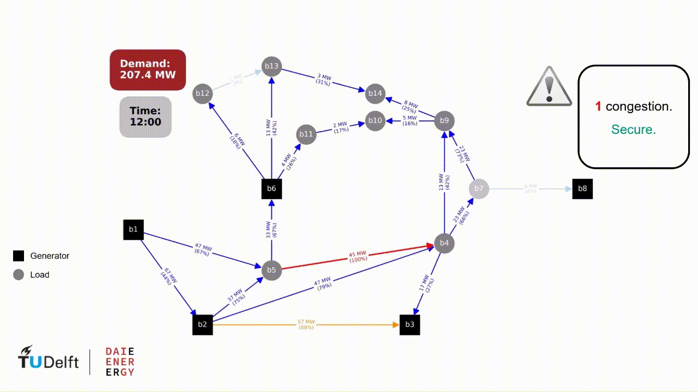
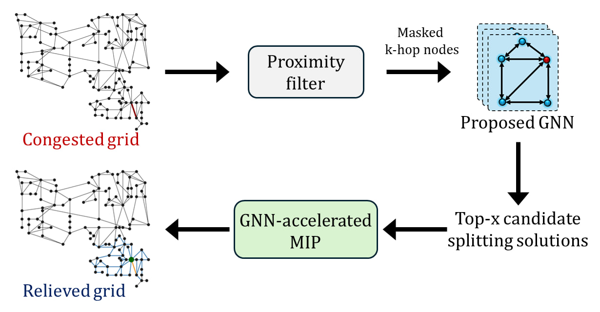

🚧 Code release in progress
# GNN-Accelerated Topology Optimization

**Author:** Ali Rajaei  
**Affiliation:** Delft-AI Energy Lab, Department of Electrical Sustainable Energy, Delft University of Technology, the Netherlands  
**Contact:** a.rajaei@tudelft.nl  
**Date:** March 2026  

This repository accompanies the research paper:

> Ali Rajaei, Peter Palensky, Jochen L. Cremer.  
> ["Transferable Graph Learning for Transmission Congestion Management via Busbar Splitting."]([https://arxiv.org/abs/2603.04203](https://arxiv.org/abs/2510.20591))  
> *PSCC*, 2026.

---

## Overview

This repository contains the implementation of:

- DC optimal substation switching (DC-OSS)
- AC optimal substation switching (AC-OSS)
- Congestion-management formulations
- Machine-learning-assisted topology control
- Feed-forward neural networks (FNNs)
- Homogeneous graph neural networks (HomoGNNs)
- Heterogeneous graph neural networks (HeteroGNNs)
- Dataset generation pipelines
- Transfer learning and generalization studies
- Computational-efficiency case studies

The framework is developed for power-system topology-control research using:
- Pyomo
- Gurobi
- PyTorch
- PyTorch Geometric

---

## 📄 Abstract

Network topology optimization (NTO) via busbar splitting can mitigate transmission grid congestion and reduce redispatch costs. However, solving this mixed-integer nonlinear problem for large-scale systems in near-real-time is currently intractable with existing solvers. Machine learning (ML) approaches have emerged as a promising alternative, but they have limited generalization to unseen topologies, varying operating conditions, and different systems, which limits their practical applicability. This paper formulates NTO for congestion management considering linearized AC power flow, and proposes a graph neural network (GNN)-accelerated approach. We develop a heterogeneous edge-aware message passing GNN to predict effective nodes for busbar splitting actions as candidate NTO solutions. The proposed GNN captures local flow patterns, improves generalization to unseen topology changes, and enhances transferability across systems. Case studies show up to 4 orders-of-magnitude speed-up, delivering AC-feasible solutions within one minute and a 2.3% optimality gap on the GOC 2000-bus system. These results demonstrate a significant step toward near-real-time NTO for large-scale systems with topology and cross-system generalization.

---

### Algorithm in action
<p align="center">
  <br>
  <em>Toy example of topology remedial action to reduce grid congestion.</em>
</p>

---
### Method Overview

<p align="center">

Workflow of the proposed GNN-accelerated network topology optimization
</p>


---

## Repository Structure

```text
├── Optimization_Functions/
│   ├── DC_Optimal_Splitting_Functions_Pyomo.py
│   └── AC_Optimal_Splitting_Functions_Pyomo.py
│
├── ML_Functions/
│   ├── Prepare_Features.py
│   ├── FNN_Functions.py
│   ├── HomoGNN_Functions.py
│   └── HeteroGNN_Functions.py
│
├── Examples_CaseStudies/
│   ├── DataGeneration_OSS.py
│   ├── CaseStudy_IVB_PredictionAccuracy.py
│   ├── CaseStudy_IVC_GeneralizationTopology.py
│   ├── CaseStudy_IVD_ZeroShotTransferability.py
│   ├── CaseStudy_IVD_TransferLearning.py
│   └── CaseStudy_IVE_ComputationalEfficiency.py
│
├── requirements.txt
├── LICENSE
└── README.md
```

---

## Main Features

### Optimization Framework
- DC-OPF and AC-OPF
- Optimal substation switching (OSS)
- Congestion-management formulations
- Contingency analysis
- Busbar splitting

### Machine Learning Models
- Feedforward neural networks (FNN)
- Homogeneous GNNs
- Heterogeneous GNNs
- Edge-aware graph attention models

### Research Studies
- Prediction accuracy
- Generalization to topology changes
- Cross-system transferability
- Transfer learning
- Computational efficiency

---

## Main Dependencies

- Python 3.12
- PyTorch 2.6
- PyTorch Geometric
- Pyomo
- Gurobi 12.0
- NumPy
- Pandas
- NetworkX
- Matplotlib

---

## Running Examples

### Generate training data

```bash
python Generate_Training_Data.py
```

### Run prediction-accuracy case study

```bash
python CaseStudy_IVB_PredictionAccuracy.py
```

### Run topology-generalization case study

```bash
python CaseStudy_IVC_GeneralizationTopology.py
```

### Run transferability case study

```bash
python CaseStudy_IVD_Transferability.py
```

### Run computational-efficiency case study

```bash
python CaseStudy_IVE_ComputationalEfficiency.py
```

---

## Citation

If you use this repository in your research, please cite:

```bibtex
@article{rajaei2025transferable,
  title={Transferable Graph Learning for Transmission Congestion Management via Busbar Splitting},
  author={Rajaei, Ali and Palensky, Peter and Cremer, Jochen L},
  journal={PSCC},
  year={2026}
}
```

---

## License

This project is licensed under the MIT License.

---

## Contact

**Ali Rajaei**  
a.rajaei@tudelft.nl and alirajaei95@gmail.com 
