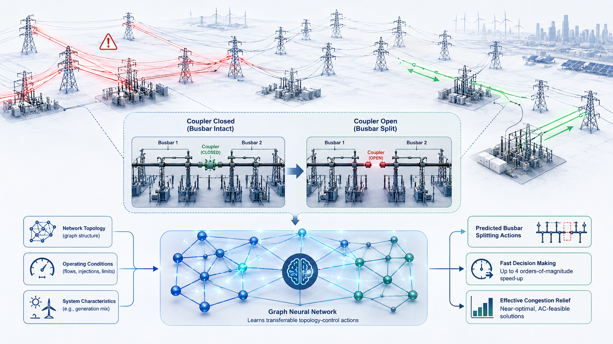

# GNN-Accelerated Network Topology Optimization

**Author:** Ali Rajaei  
**Affiliation:** Delft-AI Energy Lab, Department of Electrical Sustainable Energy, Delft University of Technology

**Contact:** a.rajaei@tudelft.nl  
**Date:** March 2026  

This repository accompanies the research paper:

> Ali Rajaei, Peter Palensky, Jochen L. Cremer.  
> ["Transferable Graph Learning for Transmission Congestion Management via Busbar Splitting."](https://arxiv.org/abs/2510.20591)   
> *Power Systems Computation Conference (PSCC)*, 2026.

---

## Overview

This repository contains the implementation of:

- DC-based optimal substation switching
- AC-based optimal substation switching 🚧
- Congestion-management formulations
- Machine-learning-accelerated topology optimization
- Feed-forward neural networks (FNNs)
- Homogeneous graph neural networks (HomoGNNs)
- Heterogeneous graph neural networks (HeteroGNNs)
- Training data generation pipelines
- Classification and regression tasks
- Training and Testing on different datasets/tasks/systems 
- Case study on accuracy 
- Case study on generalization to N-k topology changes
- Case study on transferability to unseen grids
- Case study on computational efficiency

---

## 📄 Abstract

Network topology optimization (NTO) via busbar splitting can mitigate transmission grid congestion and reduce redispatch costs. However, solving this mixed-integer nonlinear problem for large-scale systems in near-real-time is currently intractable with existing solvers. 

Machine learning (ML) approaches have emerged as a promising alternative, but they have limited generalization to unseen topologies, varying operating conditions, and different systems, which limits their practical applicability. 

This paper formulates NTO for congestion management considering linearized AC power flow, and proposes a graph neural network (GNN)-accelerated approach. We develop a heterogeneous edge-aware message passing GNN to predict effective nodes for busbar splitting actions as candidate NTO solutions. The proposed GNN captures local flow patterns, improves generalization to unseen topology changes, and enhances transferability across systems. 

Case studies show up to 4 orders-of-magnitude speed-up, delivering AC-feasible solutions within one minute and a 2.3% optimality gap on the GOC 2000-bus system. These results demonstrate a significant step toward near-real-time NTO for large-scale systems with topology and cross-system generalization.

---

### Algorithm in action
<p align="center">
  <br>
  <em>Figure 1. Toy example of topology remedial action to reduce grid congestion.</em>
</p>

---
### Method Overview

<p align="center">
  
</p>
<p align="center">
  <em>Figure 2. Conceptual illustration of the proposed GNN-based topology control framework.</em>
</p>

<p align="center">
  
</p>
<p align="center">
  <em>Figure 3. Workflow of the proposed GNN-accelerated network topology optimization.</em>
</p>

## Repository Structure

### `Optimization_Functions/`

| Purpose | Script |
|---|---|
| DC-based OPF, congestion-management, and optimal substation switching formulations | `DC_Optimal_Splitting_Functions.py` |
| AC-based OPF, congestion-management, and optimal substation switching formulations | `AC_Optimal_Splitting_Functions.py` 🚧 |
| Training data generation pipeline, random load/outage/gen cost sampling | `DataGeneration_Functions.py` |
| Helper functions for Section IV-E computational-efficiency experiments | `Casestudy_Time_Functions.py` |

---

### `ML_Functions/`

| Purpose | Script |
|---|---|
| Feature preparation for FNN, HomoGNN, and HeteroGNN models | `ML_utilities.py` |
| Feedforward neural network models, training, testing, and evaluation utilities | `FNN_Functions.py` |
| Homogeneous graph neural network models and training utilities | `HomoGNN_Functions.py` |
| Heterogeneous graph neural network models and training utilities | `HeteroGNN_Functions.py` |

---

### `Examples_CaseStudies/`

| Purpose | Script |
|---|---|
| Section IV-B: Prediction-accuracy case study | `CS_acc_118bus_example.py` |
| Section IV-C: Generalization to topology changes | `CS_top_118bus_example.py` |
| Section IV-D: Zero-shot transferability across power systems | `CS_zeroshot_118-300bus_example.py` |
| Section IV-D: Transfer learning across power systems | `CS_transfer_118-300bus_example.py` |
| Section IV-E: Computational-efficiency case study, DC 1-split | `CS_time_DC_118bus_example.py` |
| Section IV-E: Computational-efficiency case study, DC 3-split | `CS_time_multi_118bus_example.py` |
| Section IV-E: Computational-efficiency case study, AC 1-split | `CS_time_AC_118bus_example.py` |

---


## Main Dependencies

- Python 3.12
- PyTorch 2.5.0
- PyTorch Geometric 2.6.1
- Pyomo 2.9
- Gurobi 12.0
- NumPy 
- Pandas
- NetworkX
- Matplotlib


---

## Citation

If you use this repository in your research, please cite:

```bibtex
@article{rajaei2025transferable,
  title={Transferable Graph Learning for Transmission Congestion Management via Busbar Splitting},
  author={Rajaei, Ali and Palensky, Peter and Cremer, Jochen L},
  journal={Power Systems Computation Conference (PSCC)},
  year={2026}
}
```
---

## 📎 Presentation at PSCC 2026

[🔗 PSCC 2026 Presentation](https://github.com/AliRajaei95/GNN_Topology_Optimization/tree/main/Figures/PSCC2026_Ali_presentation.pdf)

---

## License

This project is licensed under the MIT License.
